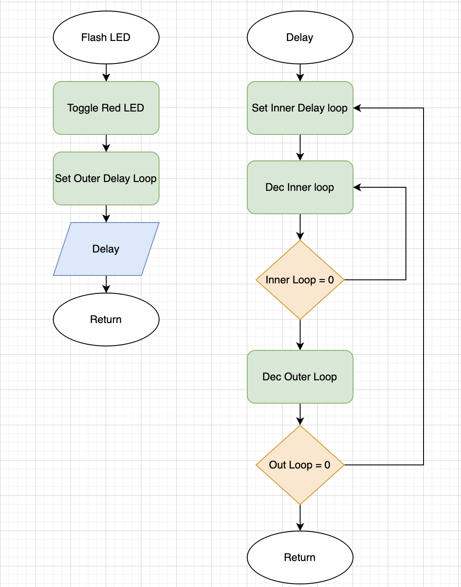
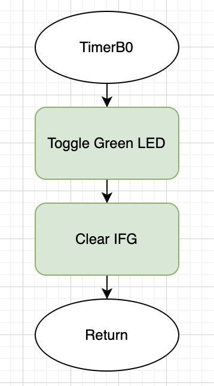

# project1-template
Making a heartbeat LED with delay loops and timers

# EELE 465: Project 1 - Heartbeat LED Implementation Report

This repository contains my implementation of the "heartbeat" LED indicator project for the MSP-EXP430FR2355 Launchpad Evaluation Board. I successfully created two independently controlled LEDs flashing at 0.5 Hz using assembly language, implementing both delay loop and timer interrupt approaches.

## Project Results

I achieved the following requirements:
- Implemented two LEDs flashing at exactly 0.5 Hz (1 second on, 1 second off)
- Created modular, reusable code in assembly language
- Verified timing accuracy using oscilloscope measurements
- Successfully demonstrated both implementation methods

## Implementation Details

### 1. Delay Loop Method (P1.0 LED)

#### Timing Results

### 2. Timer Interrupt Method (P6.6 LED)

#### Flowchart

#### Timing Results

